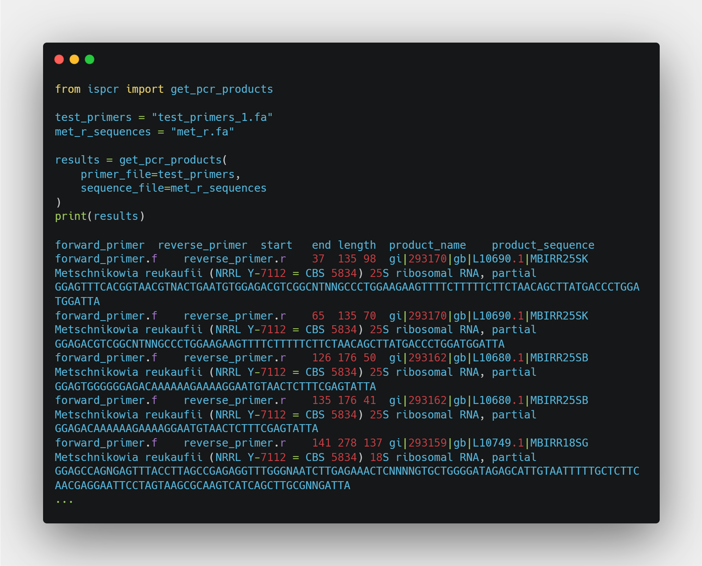
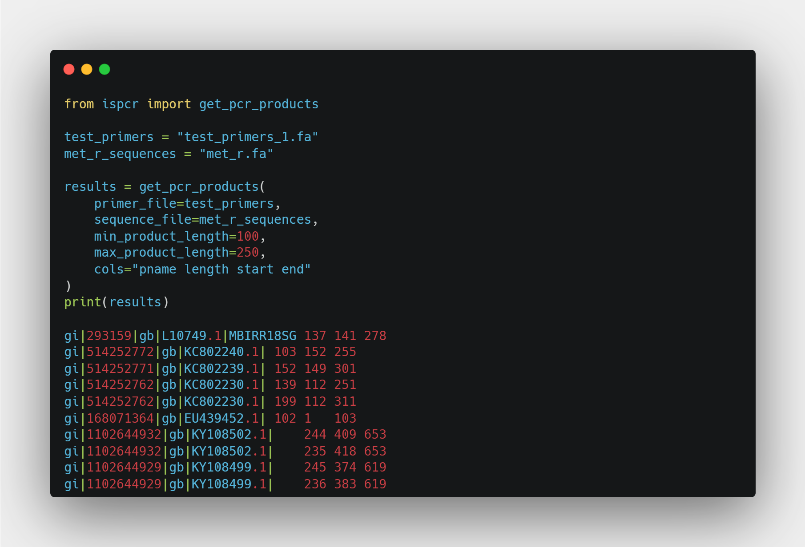
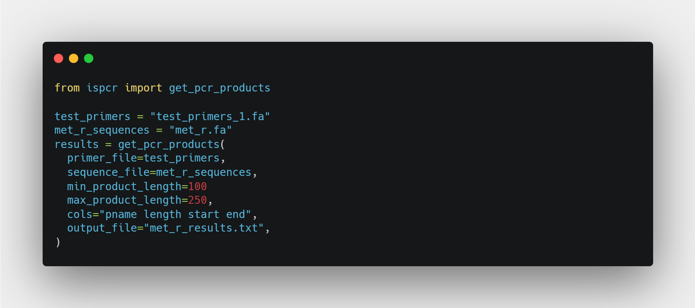
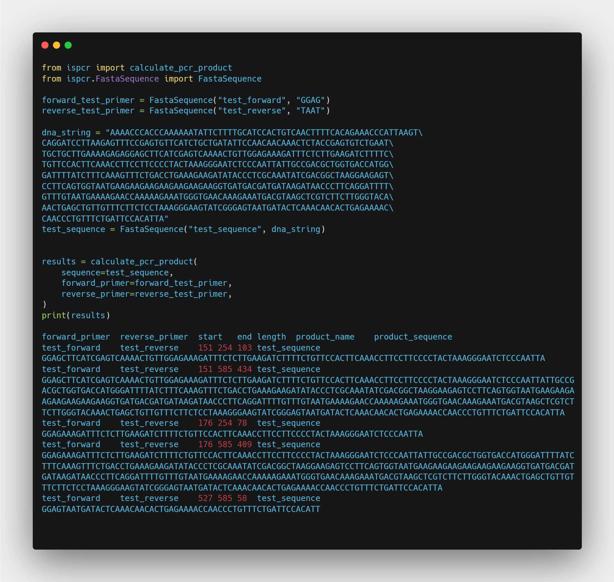
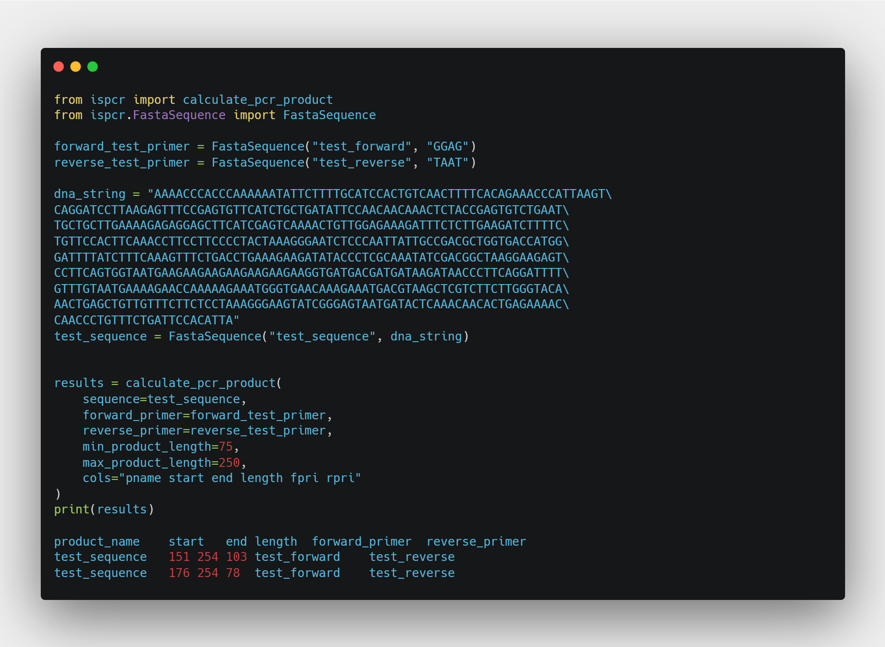

# ispcr

[](https://pypi.python.org/pypi/ispcr/)
[](https://pypi.python.org/pypi/ispcr/)
[](https://pypi.python.org/pypi/ispcr/)
[](https://github.com/woltapp/wolt-python-package-cookiecutter)


---

**Documentation**: [https://pommevilla.github.io/ispcr](https://pommevilla.github.io/ispcr)

**Source Code**: [https://github.com/pommevilla/ispcr](https://github.com/pommevilla/ispcr)

**PyPI**: [https://pypi.org/project/ispcr/](https://pypi.org/project/ispcr/)

---

A simple, light-weight package written in base Python to perform *in silico* PCR to determine primer performance.

**Currently in development**

## Installation

```sh
pip install ispcr
```
## Demonstration

### File-based *in silico* PCR

The main function to use in this package is `get_pcr_products`, which performs *in silico* PCR using two files:
  * `primer_file` - the path to fasta file containing your primers
    * This is currently limited to a fasta file containing two sequences, with the forward primer coming first and the reverse primer coming second
  * `sequence_file` the path to the fasta file containing the sequences to test your primers against

`get_pcr_products` will then iterate through the sequences in `sequence_file` and find all products amplified by the forward and reverse primer.



### Refining results

You can also refine your results by using the `min_product_length` and `max_product_length` arguments, and only print out the columns you are interested in by using the `cols` argument. For example, if we're only interested in products between 100 and 250 bp and we only want the name of the sequence the product was amplified from, the length of the product, and the start and end position of the product in the sequence:



### Writing out isPCR results to a file

`get_pcr_products` also takes an `output_file` argument. If provided, the results of the *in silico* PCR (including any product length restrictions or column selections) to that file. This will overwrite the file.



### Sequence-based *in silico* PCR

The `get_pcr_products` function is a wrapper around `calculate_pcr_product`. The following arguments are required to run `calculate_pcr_product`:
  * `sequence`: the target sequence to test the primers against
  * `forward_primer`: the forward primer used to amplify the sequence
  * `reverse_primer`: the reverse primer (5'-3') used to amplify the sequence

`sequence`, `forward_primer`, and `reverse_primer` should be entered as `FastaSequence` objects. A `FastaSequence` is just a small convenience class to package a sequence with its header. An example run of `calculate_pcr_products` might look like:



`calculate_pcr_product` uses all of the same arguments as `get_pcr_products`, so you can filter results and select columns just as before:



This will also work with the `output_file` argument.
