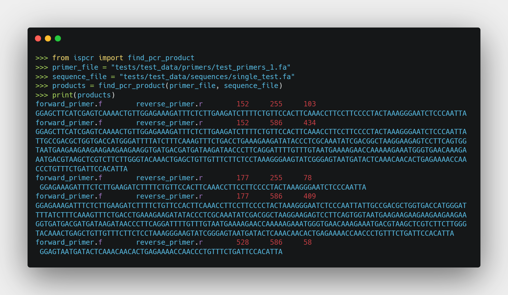
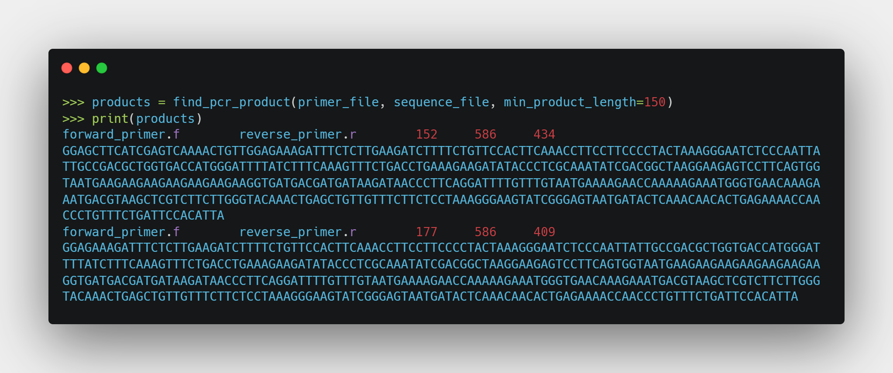

# ispcr

[](https://pypi.python.org/pypi/ispcr/)
[](https://pypi.python.org/pypi/ispcr/)
[](https://pypi.python.org/pypi/ispcr/)
[](https://github.com/woltapp/wolt-python-package-cookiecutter)


---

**Documentation**: [https://pommevilla.github.io/ispcr](https://pommevilla.github.io/ispcr)

**Source Code**: [https://github.com/pommevilla/ispcr](https://github.com/pommevilla/ispcr)

**PyPI**: [https://pypi.org/project/ispcr/](https://pypi.org/project/ispcr/)

---

A simple, light-weight package written in base Python to perform *in silico* PCR to determine primer performance.

**Currently in development**

## Installation

```sh
pip install ispcr
```
## Demonstration

The main function to use in this package is `find_pcr_product`, which takes as input two file paths:
  * `primer_file` - the path to fasta file containing your primers
    * This is currently limited to a fasta file containing two sequences, with the forward primer coming first and the reverse primer coming second
  * `sequence_file` the path to the fasta file containing the sequences to test your primers against

`find_pcr_product` will then iterate through the sequences in `sequence` file and find all products amplified by the forward and reverse primer.



`find_pcr_product` also takes a `minimum_product_length` argument:


